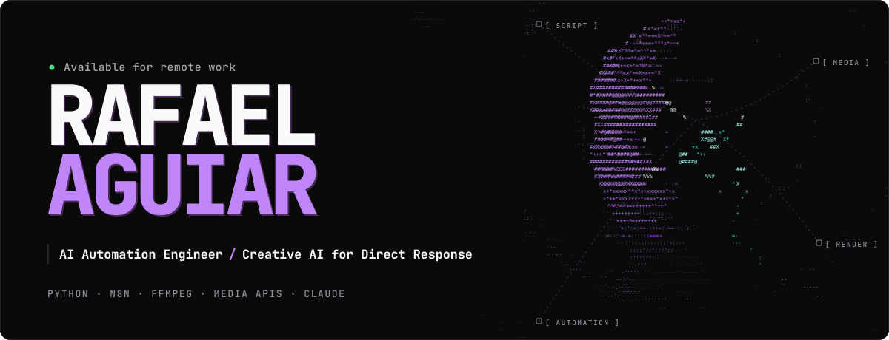

Hi, I'm Rafael. I work as a Senior AI Creator in Direct Response, making AI video for international VSLs and ads, and I write tools to automate the repetitive parts of that job.

I came from video editing. Most of what's here started as a way to stop doing the same task by hand.

### Projects

| Project | What it does | Latest |
|:--|:--|:-:|
| [Avatarize](https://github.com/rafaguiar-dev/avatarize) | Windows app that turns a photo plus audio (or text) into a talking avatar video, using your own HeyGen account through their official MCP server. | <!-- release:avatarize --><a href="https://github.com/rafaguiar-dev/avatarize/releases/tag/v1.2.0"><code>v1.2.0</code></a> Oct&nbsp;3,&nbsp;2026<!-- /release:avatarize --> |
| [LoopVideo](https://github.com/rafaguiar-dev/loopvideo) | Windows app that turns one image into a 2:30 talking loop for VSLs, with Kling and FFmpeg. It asks before spending credits. | <!-- release:loopvideo --><a href="https://github.com/rafaguiar-dev/loopvideo/releases/tag/v2.0.0"><code>v2.0.0</code></a> Sep&nbsp;28,&nbsp;2026<!-- /release:loopvideo --> |
| [Portfolio](https://github.com/rafaguiar-dev/rafaguiar-dev.github.io) | My site. Plain HTML, CSS and a canvas, no framework. | <a href="https://rafaguiar-dev.github.io/">site</a> |

The Latest column is filled in every morning by a <a href="https://github.com/rafaguiar-dev/rafaguiar-dev/blob/main/scripts/update_readme.py">small script</a> on GitHub Actions.

### Personal project

A production pipeline for my own YouTube channel. From a topic, it writes the script, generates narration and visuals, and then either renders an MP4 or builds an editable CapCut project, which is where I finish the edit by hand. Python and self-hosted n8n, with a small FastAPI panel to run it. The target cost is about US$1 per video; narration is 88% of that, and rendering takes 58% of the time. The code is private.

### Tools I use

- **Code:** Python, FastAPI, JavaScript (Chrome extensions), FFmpeg, Whisper
- **Automation:** n8n, Playwright, REST APIs, webhooks, MCP
- **AI:** HeyGen, Kling, MiniMax, ElevenLabs, Magnific, Higgsfield, Claude

### Contact

[LinkedIn](https://www.linkedin.com/in/rafaguiar-dev/) · [rafaguiar.dev@gmail.com](mailto:rafaguiar.dev@gmail.com) · [Portfolio](https://rafaguiar-dev.github.io/)

Remote, based in Brazil (UTC−3). Portuguese native, English intermediate/advanced.

Em português

 

Oi, sou Rafael Aguiar. Trabalho como IA Creator Sênior em Direct Response, fazendo vídeo com IA para VSLs e anúncios do mercado internacional, e escrevo ferramentas para automatizar a parte repetitiva desse trabalho.

Vim da edição de vídeo. Quase tudo aqui começou como um jeito de parar de fazer a mesma tarefa à mão.

- **Avatarize:** app para Windows que transforma foto + áudio (ou texto) em vídeo de avatar falando, usando a sua conta HeyGen.
- **LoopVideo:** app para Windows que transforma uma imagem em um loop de fala de 2:30 para VSL.
- **Projeto pessoal:** um pipeline para o meu canal no YouTube. A partir de um tema, ele escreve o roteiro, gera narração e imagens e monta o vídeo (MP4 ou projeto do CapCut, onde eu termino a edição à mão).

Trabalho remoto, no Brasil. [LinkedIn](https://www.linkedin.com/in/rafaguiar-dev/) · [rafaguiar.dev@gmail.com](mailto:rafaguiar.dev@gmail.com)

